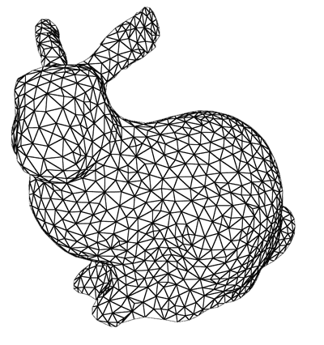
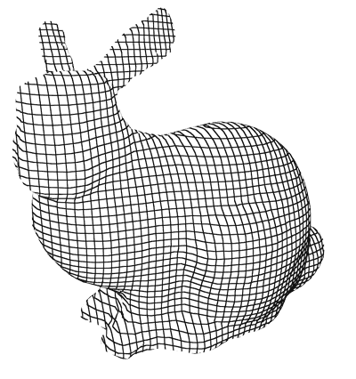

# glsl-solid-wireframe

> draw wireframes on a triangular mesh using a fragment shader

This module uses barycentric coordinates to draw a wireframe on a solid triangular mesh. Alternatively, it will simply draw grid lines at integer component values of a float- or vector-valued variable which you give it.

You can see a detailed explanation of the technique [here](http://codeflow.org/entries/2012/aug/02/easy-wireframe-display-with-barycentric-coordinates/). It uses [`OES_standard_derivatives`](https://www.khronos.org/registry/gles/extensions/OES/OES_standard_derivatives.txt) to scale the lines to a uniform width, but also exposes a basic fallback that scales lines relative to the size of the triangle in case `OES_standard_derivatives` is not available. [Support for `OES_standard_derivatives` is 96% for mobile and 99% across the board](http://webglstats.com/webgl/extension/standard_derivatives).

Please ***do not*** confuse it with nVidia's [Solid Wireframe technique](http://developer.download.nvidia.com/SDK/10/direct3d/Source/SolidWireframe/Doc/SolidWireframe.pdf). That technique uses a geometry shader so will not be available in WebGL any time soon.

## Example

<p align="center">
  <a href="http://rreusser.github.io/glsl-solid-wireframe/barycentric.html">
    
  </a>
  <br>
  Barycentric coordinate based mesh. <a href="http://rreusser.github.io/glsl-solid-wireframe/barycentric.html">See demo &rarr;</a>
</p>

<p align="center">
  <a href="http://rreusser.github.io/glsl-solid-wireframe/cartesian.html">
    
  </a>
  <br>
  Cartesian coordinate based mesh. <a href="http://rreusser.github.io/glsl-solid-wireframe/cartesian.html">See demo &rarr;</a>
</p>

Or see an interactive demo [here](http://rreusser.github.io/glsl-solid-wireframe/demo.html). Code using [regl](https://github.com/regl-project/regl) to draw a barycentric triangular mesh is below.

```javascript
const regl = require('regl')({extensions: ['oes_standard_derivatives']});
const glsl = require('glslify');
const camera = require('regl-camera')(regl);
const mesh = require('glsl-solid-wireframe')(require('bunny'));

const draw = regl({
  frag: glsl`
    #extension GL_OES_standard_derivatives : enable
    precision mediump float;
    #pragma glslify: grid = require(glsl-solid-wireframe/barycentric/scaled)
    varying vec2 b;
    void main () {
      gl_FragColor = vec4(vec3(grid(b, 1.0)), 1);
    }
  `,
  vert: `
    precision mediump float;
    uniform mat4 projection, view;
    attribute vec3 position;
    attribute vec2 barycentric;
    varying vec2 b;
    void main () {
      b = barycentric;
      gl_Position = projection * view * vec4(position, 1);
    }
  `,
  attributes: {
    position: mesh.positions,
    barycentric: mesh.barycentric
  },
  elements: mesh.cells,
});

regl.frame(() => {
  regl.clear({color: [1, 1, 1, 1], depth: 1});
  camera(draw);
});
```

## API

### Installation

```bash
$ npm install glsl-solid-wireframe
```

### JavaScript API

In order to use the barycentric wireframe shader, each triangle must have a `vec2` vertex attribute that is `[0, 0]` in one corner, `[1, 0]` in the second, and `[0, 1]` in the third. Since assigning these attributes without duplicating the mesh is not a straightforward assignemnt problem, the module exports a function that simply expands the mesh and assigns the proper attributes. The extra storage may be prohibitive, but you certainly don't need to use this convenience function in order to use the shaders. You may be able to do better (PR welcome!) or barycentric coordinate assignment may simply be trivial for your geometry.

### var wmesh = require('glsl-solid-wireframe')(mesh[, opts = {}])

Create a wireframe mesh given an existing triangular mesh.

The input must be a simplicial complex consisting of `positions` and `cells`.

The wireframe mesh has these properties:
- `wmesh.positions`: an array of `[x, y, z]` vertex arrays
- `wmesh.cells`: an array of triangle indices
- `wmesh.attributes`: extra attributes transferred from the input. See below.

You may optionally provide `opts.attributes`. If you do, the attribute references will be copied for each element into a new list of vertex attribute arrays.

### glslify API

To require the modules via [glslify](https://github.com/stackgl/glslify):

```glsl
#pragma glslify bary_wire_scaled = require(glsl-solid-wireframe/barycentric/scaled)
#pragma glslify bary_wire_unscaled = require(glsl-solid-wireframe/barycentric/unscaled)
#pragma glslify cart_wire_scaled = require(glsl-solid-wireframe/cartesian/scaled)
#pragma glslify cart_wire_unscaled = require(glsl-solid-wireframe/cartesian/unscaled)
```

#### `float bary_wire_scaled(vec2 b, float width[, float feather = 0.5])`

Returns 0.0 on the grid lines and 1.0 on the rest of the triangle. `b` is the `varying vec2` barycentric coordinate, `width` is the width of the grid lines in pixels, and `feather` is the radius on either side of `width` over which to transition in order to avoid sharp aliasing. In order to use this shader, `OES_standard_derivatives` must be available so this function is only available in a fragment shader.

#### `float bary_wire_unscaled(vec2 b, float width[, float feather = 0.5])`

Returns 0.0 on the grid lines and 1.0 on the rest of the triangle. `b` is the `varying vec2` barycentric coordinate, `width` is the width of the grid lines where `0.0` shows no lines at all and `1.0` causes all three lines to meet in the center, and `feather` is the radius on either side of `width` over which to transition in order to avoid sharp aliasing. This shader does not use `OES_standard_derivatives`.

#### `float cart_wire_scaled(genType v, float width[, float feather = 0.5])`

Returns 0.0 on the grid lines and 1.0 on the rest of the triangle. `v` is a `float`, `vec2`, `vec3`, or `vec4`. Grid lines will appear at integer values of any of the components. `width` is the width of the grid lines in pixels, and `feather` is the radius on either side of `width` over which to transition in order to avoid sharp aliasing. In order to use this shader, `OES_standard_derivatives` must be available so that this is only available in a fragment shader.

#### `float cart_wire_unscaled(genType v, float width[, float feather = 0.5])`

Returns 0.0 on the grid lines and 1.0 on the rest of the triangle. `v` is a `float`, `vec2`, `vec3`, or `vec4`. Grid lines will appear at integer values of any of components. `width` is the width of the grid lines where `0.0` shows no lines at all and `1.0` causes all three lines to meet in the center, and `feather` is the radius on either side of `width` over which to transition in order to avoid sharp aliasing. This shader does not use `OES_standard_derivatives`.

## See also

- [screen-projected-lines](https://github.com/substack/screen-projected-lines)

## License
&copy; Ricky Reusser 2016. MIT License.
